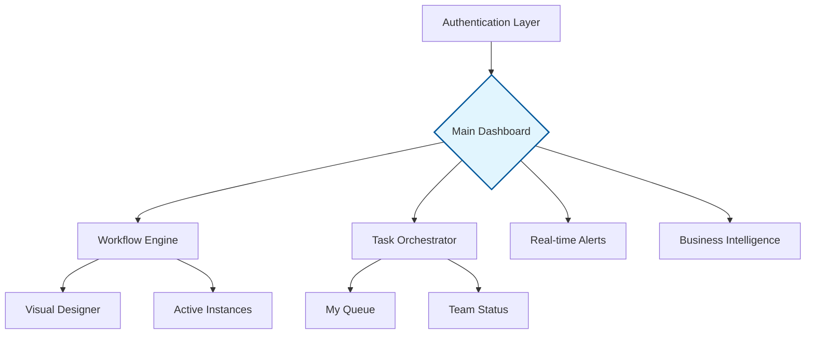

# CS 331 – Software Engineering Lab
## Assignment 6: User Interface Design
**Project:** Intelligent Business Process Automation (BPA) Platform

---

## I. Strategic UI Selection

For the **Intelligent Business Process Automation (BPA)** platform, we have implemented a hybrid UI strategy: a **Menu-Based Interface** integrated with a **Direct Manipulation Interface**. This combination balances administrative structure with the intuitive, tactile needs of modern workflow management.

### 1. Interface Paradigms

* **Menu-Based Navigation:** A structured, persistent framework that provides a clear roadmap of system capabilities.
* **Direct Manipulation (GUI):** A dynamic workspace where users interact with objects—such as task cards and flow nodes—using intuitive actions like dragging, dropping, and toggling.

---

## 2. Design Justification

The selection of this hybrid UI is based on several core User Experience (UX) goals:

### A. Optimization of Cognitive Load
By using a **Menu-Based** system, we minimize the "search time" for features. Users do not need to memorize complex commands; instead, they rely on recognition over recall.

### B. Visual Logic & Workflow Transparency
**Direct Manipulation** allows users to perceive the "state" of a business process instantly. 
* **Visual Feedback:** Moving a task card provides immediate confirmation of a state change.
* **Intuitive Mapping:** The UI mimics real-world mental models of moving a physical file from one desk to another.

### C. Role-Based Access Control (RBAC) Integration
The menu system dynamically adapts to the user's authorization level, ensuring a clutter-free experience for different stakeholders.

| User Role | Primary Functional Access | Key UI Interaction |
| :--- | :--- | :--- |
| **Administrator** | System Config, User Logs, Global Schema | Schema Designer (Drag-and-Drop) |
| **Manager** | Resource Allocation, Escalations, Analytics | Heatmaps & Performance Toggles |
| **Employee** | Personal Queue, Status Updates | Kanban Boards & Task Cards |

---

## 3. System Navigation Architecture

The following diagram illustrates the information architecture of the BPA platform:

---

## 4. Critical UI Components

The BPA platform is composed of five high-fidelity modules:

* **Global Navigation Sidebar:** A collapsible menu providing high-level routing.
* **Interactive Workflow Canvas:** A direct manipulation area for designing processes via node-based editing.
* **Dynamic Task Board:** A Kanban-style interface for moving tasks through lifecycle stages (e.g., Pending → Active → Validated).
* **Contextual Notification Hub:** A slide-out panel for time-sensitive escalations and system triggers.
* **BI Analytics Suite:** A data visualization layer utilizing interactive charts for bottleneck identification.

---

## 5. Comparative Advantages

| Feature | Benefit to the Organization |
| --- | --- |
| **Discoverability** | New users can find features via menus without extensive training. |
| **Error Reduction** | Direct manipulation limits input errors through constrained visual movements. |
| **Scalability** | New modules can be added to the menu hierarchy without disrupting existing workflows. |
| **Responsiveness** | Clear visual cues (progress bars, status icons) provide real-time operational awareness. |

---

## Conclusion

The synergy between a **Menu-Based Interface** and **Direct Manipulation** creates a robust environment for Intelligent Business Process Automation. This design ensures that the platform is powerful enough for complex logic design while remaining accessible for daily operational tasks. By prioritizing structural clarity and visual interaction, the BPA platform minimizes user friction and maximizes organizational throughput.

