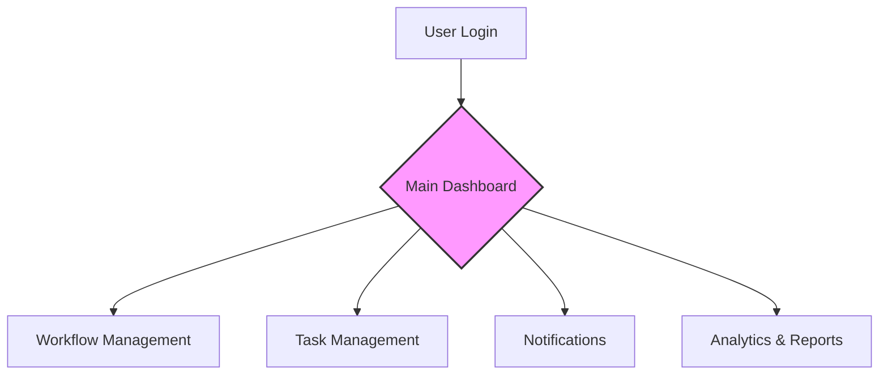

```markdown
# CS 331 – Software Engineering Lab
## Assignment 6: User Interface Design

**Project:** Intelligent Business Process Automation (BPA) Platform

---

## I. Selection of User Interface for the System

For the **Intelligent Business Process Automation (BPA)** platform, a **Menu-Based User Interface** combined with a **Direct Manipulation Interface** has been selected as the primary UI approach. 

This hybrid design is specifically tailored for workflow automation systems where users must transition seamlessly between high-level navigation and granular task interaction.

---

## 1. Type of User Interface Selected

The system will leverage a dual-mode interaction model:

* **Menu-Based Interface:** Provides a structured, hierarchical gateway to the platform's diverse functionalities.
* **Direct Manipulation Interface:** Allows users to interact with workflow elements visually via drag-and-drop actions, clickable task cards, and interactive dashboards.

---

## 2. Justification for Selection

The chosen interface strategy addresses the specific complexities of a BPA system through the following benefits:

### A. Ease of Use
A menu-based system abstracts the underlying complexity of the automation engine. Users can navigate features like **Workflow Creation**, **Task Management**, and **Analytics** without requiring technical or programming knowledge.

### B. Structured Navigation
The system follows a clear logical hierarchy, which reduces cognitive load. 

**Navigation Hierarchy:**
* **Dashboard** (Overview of all activities)
* **Workflows**
    * Create New Workflow
    * View/Edit Existing Workflows
* **Tasks**
    * Assigned Tasks
    * Completed Tasks
* **Notifications** (Alerts and Escalations)
* **Reports & Analytics** (Performance metrics)

### C. Visual Workflow Interaction
Direct manipulation allows for a "What You See Is What You Get" (WYSIWYG) experience.
* **Drag-and-Drop:** Move tasks between stages (e.g., "In Progress" to "Review").
* **Instant Action:** One-click buttons for approvals or rejections.
* **Progress Tracking:** Visual bars and Gantt-style charts for real-time status updates.

### D. Multi-Role Support
The interface dynamically adapts based on the logged-in user's permissions, ensuring security and relevance.

| Role | Primary Menu Options |
| :--- | :--- |
| **Administrator** | Workflow engine config, user management, global analytics |
| **Manager** | Task approval, department monitoring, escalation handling |
| **Employee** | Personal task queue, status updates, notification feed |

---

## 3. Example User Interface Layout

The following flowchart represents the high-level navigation flow of the **Main Dashboard**:



---

## 4. Key UI Components

The BPA platform includes these core functional modules:

1. **Navigation Menu:** A persistent sidebar or top-bar for global navigation.
2. **Workflow Dashboard:** A visual canvas showing the lifecycle of active processes.
3. **Task Panel:** A centralized "To-Do" list where users can update statuses.
4. **Notification Center:** A real-time feed for alerts, deadlines, and system messages.
5. **Analytics Dashboard:** A data-rich view using charts and graphs to show bottleneck trends and ROI.

---

## 5. Advantages of the Selected UI

* **Simple Navigation:** No "hidden" features; everything is accessible via the menu.
* **Intuitive Interaction:** Familiar patterns (drag-and-drop) reduce the learning curve.
* **Clear Visualization:** Users can "see" their business processes rather than reading logs.
* **Role-Based Efficiency:** Users only see what they need, reducing clutter.
* **Enhanced Productivity:** Streamlined workflows lead to faster task completion.

---

## Conclusion

The combination of a **Menu-Based Interface** and **Direct Manipulation** provides the structural integrity and interactive flexibility required for a modern BPA platform. This design ensures that the system is powerful enough for administrators but simple enough for daily users, ultimately driving higher adoption rates and organizational efficiency.

