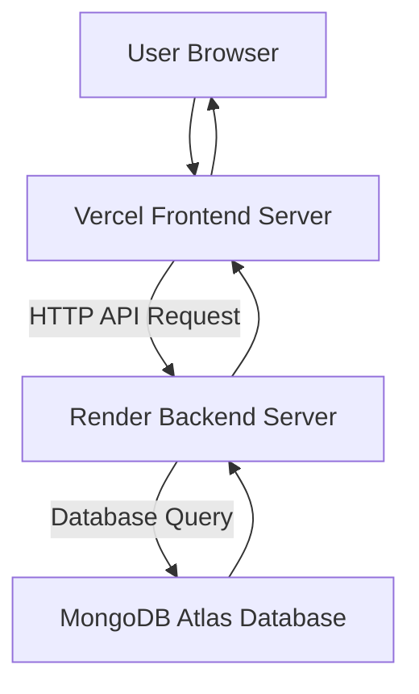

# CS 331 – Software Engineering Lab  
## Assignment 5  
### Part I – Hosting of Application Components

---

# 1. Host Site

The application components will be hosted using a **cloud-based deployment architecture** to ensure scalability, reliability, and accessibility.

### Frontend (User Interface)
- **Hosting Platform:** Vercel
- **Purpose:**
  - Deliver the web interface to users
  - Serve static frontend resources
  - Provide fast global access using CDN

---

### Backend (Application Server)
- **Hosting Platform:** Render Cloud Platform
- **Purpose:**
  - Handle application logic
  - Process API requests from the frontend
  - Manage communication with the database

---

### Database
- **Hosting Platform:** MongoDB Atlas (Cloud Database)
- **Purpose:**
  - Store user data and application records
  - Maintain persistent storage
  - Provide secure and scalable database services

---

# 2. Deployment Strategy

The system deployment follows a structured cloud deployment process.

---

## Step 1: Application Development
- Frontend developed using:
  - HTML
  - CSS
  - JavaScript / React

- Backend developed using:
  - Node.js
  - Express Framework

---

## Step 2: Backend Server Configuration
- Setup backend runtime environment
- Configure environment variables
- Define REST API endpoints

Example API endpoints:

- `/login`
- `/register`
- `/fetch-data`
- `/submit-data`

---

## Step 3: Frontend Deployment
- Build the frontend project for production.
- Deploy the compiled frontend files to **Vercel**.
- Configure API URL to connect with backend server.

---

## Step 4: Backend Deployment
- Deploy backend application to **Render** cloud platform.
- Configure:
  - Application port
  - API routes
  - Database connection string

---

## Step 5: Database Setup
- Create a **MongoDB Atlas cluster**
- Configure:
  - Database collections
  - Authentication credentials
  - Access permissions

---

## Step 6: API Communication

Communication between application components follows this flow:

**Frontend → Backend API → Database**

1. User interacts with the frontend.
2. Frontend sends HTTP request to backend API.
3. Backend processes the request.
4. Backend queries the database if required.
5. Response is returned to frontend.

---

# 3. Security Measures

To ensure secure communication and data protection, the following measures will be applied.

### HTTPS Encryption
- All client-server communication will use **HTTPS** protocol.

### Authentication
- **JSON Web Tokens (JWT)** will be used for user authentication.

### Database Security
- Secure connection strings
- IP access control
- Authentication credentials

### Firewall Protection
- Cloud servers provide built-in firewall rules to prevent unauthorized access.

---

# Deployment Architecture Diagram

---

# Summary

The application uses a **cloud-based multi-tier architecture**:

- **Frontend:** Hosted on Vercel for fast user access.
- **Backend:** Hosted on Render to process application logic and APIs.
- **Database:** MongoDB Atlas provides scalable and secure data storage.

This architecture ensures:

- High availability
- Secure communication
- Easy deployment and scalability
- Efficient interaction between system components