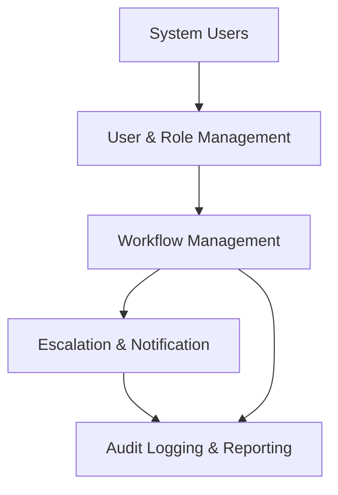

# CS 331 – Software Engineering Lab

## Assignment 5 – Part III

## Implementation of Application Components

### Project: Intelligent Business Process Automation (BPA) System

---

# 1. Introduction

The Intelligent Business Process Automation (BPA) system is designed to automate workflow processes within an organization. The system consists of multiple modular components that collaborate to manage workflows, assign tasks, escalate delayed activities, notify users, manage user roles, and maintain system logs.

For this assignment, four application components were implemented as independent modules:

* Workflow Management Module
* Escalation and Notification Module
* User and Role Management Module
* Audit Logging and Reporting Module

These modules interact with each other to simulate a real enterprise workflow automation system.

---

# 2. Implemented Application Components

The system contains the following four modules.

---

## 2.1 Workflow Management Module (Module 1)

### Purpose

The Workflow Management module is responsible for controlling the lifecycle of workflows and tasks within the system.

### Main Responsibilities

* Creating workflows
* Adding tasks to workflows
* Assigning tasks to users
* Tracking task completion
* Completing workflows when all tasks are finished

### Key Classes

* `Workflow`
* `Task`

### Functional Overview

The Workflow class manages a list of tasks and controls the workflow status. Each task can be assigned to a user and marked as completed.

### Example Operations

* Create workflow
* Add tasks to workflow
* Assign tasks to users
* Track task status
* Complete workflow

---

## 2.2 Escalation and Notification Module (Module 2)

### Purpose

This module monitors task delays and escalates tasks that remain incomplete beyond a predefined threshold.

### Main Responsibilities

* Monitor task pending duration
* Escalate delayed tasks
* Send notifications to managers
* Inform users about task status updates

### Key Classes

* `EscalationHandler`
* `NotificationService`
* `Task` (for escalation tracking)

### Escalation Logic

If a task:

* is **not completed**, and
* has been **pending for more than 3 days**

then the task is escalated to the responsible manager.

### Example Actions

* Escalate delayed tasks
* Notify managers about urgent tasks
* Send completion notifications to users

---

## 2.3 User and Role Management Module (Module 3)

### Purpose

This module manages system users and their roles within the BPA platform.

### Main Responsibilities

* Create system users
* Manage user roles
* Assign tasks to appropriate users

### Key Classes

* `User`
* `RoleManager`
* `TaskAssignmentService`

### Supported Roles

The system supports multiple user roles including:

* Employee
* Manager
* Administrator

### Example Operations

* Register users
* Display user details
* Assign tasks based on role

---

## 2.4 Audit Logging and Reporting Module (Module 4)

### Purpose

This module records system activities and generates workflow performance reports.

### Main Responsibilities

* Record system events
* Maintain activity logs
* Generate workflow completion reports

### Key Classes

* `AuditManager`
* `AuditLog`
* `ReportGenerator`

### Example Logged Events

* Workflow creation
* Task assignment
* Task completion
* Workflow completion

### Reporting Features

* Total number of tasks
* Completed tasks
* Pending tasks
* Workflow status

---

# 3. Interaction Between Application Components

The four modules interact with each other to simulate a complete BPA system.

The interaction flow is as follows:

1. Users are created and managed through the User Management module.
2. The Workflow module creates workflows and tasks.
3. Tasks are assigned to users using the Role Management module.
4. The Escalation module monitors task delays and escalates overdue tasks.
5. Notifications are sent to users and managers.
6. The Audit module records system activities.
7. Reports are generated based on workflow execution data.

---

## Component Interaction Diagram

---

# 4. Integrated System Simulation

An integrated simulation program was implemented to demonstrate how all modules interact together.

The simulation performs the following actions:

1. Create system users
2. Create a workflow
3. Add tasks to the workflow
4. Assign tasks to users
5. Monitor task delays
6. Escalate overdue tasks
7. Record system events
8. Generate workflow completion reports

This simulation provides a realistic representation of how a BPA platform operates in an enterprise environment.

---

# 5. Key Features of the Implemented System

The implemented BPA system demonstrates the following capabilities:

* Modular architecture
* Task-based workflow management
* Automated escalation mechanisms
* User and role management
* Real-time notifications
* Activity logging and reporting
* Interaction between multiple application components

---

# 6. Conclusion

The Intelligent BPA System successfully demonstrates the implementation and interaction of multiple application components in a workflow automation environment. By dividing the system into modular components, the system becomes easier to maintain, extend, and scale.

The interaction between workflow management, escalation handling, user management, and audit logging provides a simplified representation of real enterprise business process automation platforms.

---

